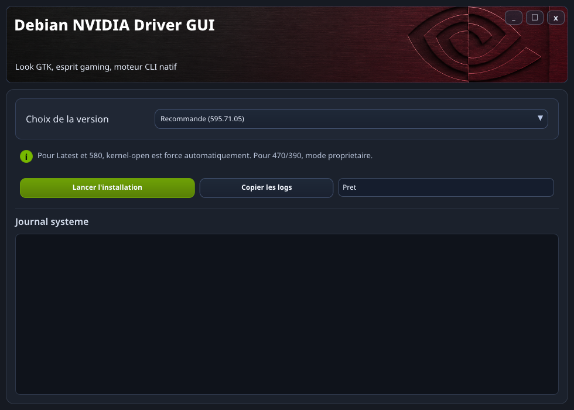

# Debian NVIDIA All

Installer/build helper pour drivers NVIDIA sur Debian, avec interface graphique simple.



## Installation recommandee (facile)

Pour la plupart des utilisateurs, prenez le **.deb** dans les GitHub Releases.

- Installation simple
- Lanceur integre
- **Mises a jour automatiques de l'application** au lancement, sans mise à jour du paquet système. (canal stable `latest`)

En bref: si vous voulez "installer et utiliser", choisissez le `.deb`.

## Version complete (avancee)

La version complete autonome est aussi distribuee en **`tar.gz`** dans les Releases.

Ce format est utile si vous voulez:

- utiliser les scripts directement
- deplacer l'app facilement sans installation systeme
- faire du debug/dev plus avance

Le `tar.gz` contient notamment:

- `debian-nvidia-all-gui`
- `debian-nvidia-all-tui.sh`
- `debian-nvidia-all-cli.sh`

## Ce que fait le projet

Le projet automatise:

- la detection/selection de version NVIDIA
- la gestion des dependances necessaires
- la generation/installation via Pacstall
- l'execution des patchs requis selon la branche driver

## Compatibilite (resume)

Support principal:

- Recommande (canal stable par defaut)
- Latest (cartes recentes)
- 580xx
- 470xx
- 390xx

Resume cartes supportees:

- Recommande / Latest: GTX serie 16 et RTX
- 580xx: GTX 900 et GTX 1000
- 470xx: GTX 600, GTX 700, certaines GTX 800M
- 390xx: GTX 400 et GTX 500

Note: sur kernels tres recents, certaines branches legacy peuvent demander des patchs plus recents.

## Modes d'utilisation

- **GUI (recommande)**: interface graphique
- **TUI**: assistant terminal
- **CLI**: mode script/avance

Architecture:

- Backend metier unique: `debian-nvidia-all-cli.sh`
- TUI et GUI utilisent ce backend

## Pour les utilisateurs avances

Exemples:

```bash
bash ./debian-nvidia-all-cli.sh --help
bash ./debian-nvidia-all-tui.sh
```

GUI depuis les artefacts release:

```bash
./debian-nvidia-all-gui
```

## Remerciements

- TKG / nvidia-all pour l'idee initiale et la base patchs:
  https://github.com/Frogging-Family/nvidia-all
